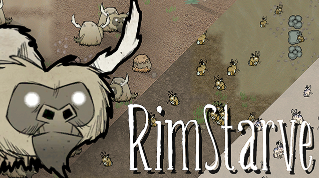

RimStarve Mod
===========

Introduction
------------

This mod for [RimWorld](https://rimworldgame.com/) adds creatures found in the game
[Don't Starve](https://www.kleientertainment.com/games/dont-starve) by Klei Entertainment.

Features:
- At this moment, 2 different animals (Beefalos and Rabbits) 
- High resolution graphics, additionally modified to better fit the Rimworld's graphical style 
- Separate contextual texture sets, e.g. for sheared beefalos and freezing rabbits as well as for sleeping animals 
- Customized rabbit AI 

Usage
-----

Simply clone this repository to your `steamapps/common/RimWorld/Mods` folder or
add the mod from [Steam Workshop](http://steamcommunity.com/sharedfiles/filedetails/?id=824132570).

Compatibility
-------------

This mod doesn't override any classes or defs and *should* be compatible with most other mods. Your mileage may vary.
